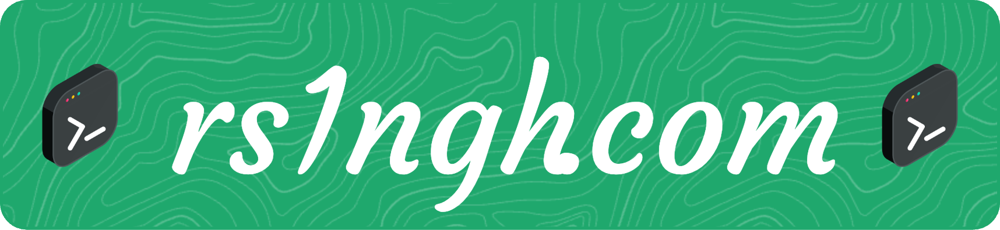

I am a Sophomore at Princeton University studying computer science

- 🔭 I’m currently working on building better safety for Agentic AI
- 🌱 I'm currently learning about methods for 3D rendering (NeRF, Gaussian Splatting, etc)
- 🃏 In my free time I like to learn new magic tricks

## 🛠️ Languages and Tools

 

  
   
  

## 🐍 My Contributions

  <picture>
    <source media="(prefers-color-scheme: dark)" srcset="https://raw.githubusercontent.com/rsingh135/rsingh135/output/github-contribution-grid-snake-dark.svg" />
    <source media="(prefers-color-scheme: light)" srcset="https://raw.githubusercontent.com/rsingh135/rsingh135/output/github-contribution-grid-snake.svg" />
    
  </picture>

<!--
## 🎧 Currently Listening To

  

!-->

 

  
  

<!--
**rsingh135/rsingh135** is a ✨ _special_ ✨ repository because its `README.md` (this file) appears on your GitHub profile.

Here are some ideas to get you started:

- 🔭 I’m currently working on ...
- 🌱 I’m currently learning ...
- 👯 I’m looking to collaborate on ...
- 🤔 I’m looking for help with ...
- 💬 Ask me about ...
- 📫 How to reach me: ...
- 😄 Pronouns: ...
- ⚡ Fun fact: ...
-->
